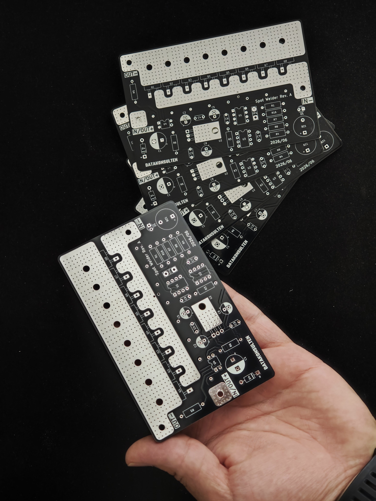

# Datakonsulten Spot Welder

An ATtiny13-controlled battery spot welder designed for welding nickel strip to lithium-ion cells when building or repairing battery packs.

The welder is powered by a 12 V automotive battery or another suitable high-current battery source. The PCB, schematic, firmware, enclosure, and fabrication files are included in this repository.


> [!WARNING]
> This project switches extremely high current from a battery. Incorrect wiring, insufficient conductors, short circuits, or excessive pulse duration can cause fire, burns, damaged cells, destroyed MOSFETs, or battery failure. Read the [Safety](#safety) section before building or operating the welder.

## Sponsor

PCB fabrication for this project was sponsored by [PCBWay](https://www.pcbway.com/).



## Features

* **Eight-MOSFET switching bank**
  Eight IRF1404 N-channel MOSFETs are connected in parallel to switch the welding current. Each MOSFET has an individual 10 Ω gate resistor to help control switching and reduce gate ringing.

* **Dedicated MOSFET gate driver**
  An MCP1407 drives all eight MOSFET gates simultaneously. A hardware pull-down resistor on the driver input keeps the MOSFET bank off while the microcontroller is starting, resetting, or unpowered.

* **Automatic touch-to-weld triggering**
  A PC817 optocoupler-based sensing circuit detects when both welding probes are in contact with a conductive workpiece. The isolated output signals the ATtiny13 to begin the welding sequence.

* **Adjustable 1–10 ms main pulse**
  A pushbutton connected to TP4 cycles the main weld-pulse duration from 1 to 10 ms.

* **EEPROM setting storage**
  The selected weld duration is saved in the ATtiny13 EEPROM and restored after the welder is disconnected from power.

* **LED and buzzer feedback**
  The onboard LED and passive piezo buzzer provide startup, welding, and setting-change feedback. When the duration is changed, the LED flashes and the buzzer beeps once for each selected millisecond.

* **Optional double-pulse welding**
  The firmware can produce a short pre-pulse followed by the adjustable main pulse. The pre-pulse can help settle the probe contact before the main weld.

* **Separated control and power grounds**
  The high-current welding ground (`GND`) and logic ground (`CTRL_GND`) are routed separately and joined at a single net-tie point to reduce switching noise at the microcontroller.

* **Reverse-polarity protection**
  A 1N5819 Schottky diode protects the 5 V control supply if the battery input is accidentally connected with reversed polarity.

* **Transient suppression**
  Four 5.0SMDJ14A TVS diodes help clamp voltage transients generated by the welding cables and other parasitic inductance when the MOSFET bank switches off.

* **Large high-current connection pads**
  The battery and welding connections use large exposed copper pads intended for soldered or mechanically secured high-current conductors.

* **Four-layer PCB**
  Copper zones on F.Cu, In1.Cu, In2.Cu, and B.Cu help distribute the short welding-current pulses through the MOSFET bank.

> [!IMPORTANT]
> PCB copper alone should not be treated as a complete high-current busbar. Thick copper cable, copper braid, copper strip, or another suitable reinforcement is recommended for the main battery and electrode current paths.

## How it works

1. **Power input**
   A 12 V automotive battery or another suitable high-current battery source is connected to the `IN/OUT+` and `IN-` pads.

2. **Probe contact detection**
   When both welding probes contact the conductive workpiece, the PC817 sensing circuit produces an isolated trigger signal for the ATtiny13.

3. **Trigger validation**
   The firmware verifies that the contact signal remains active for the configured debounce period.

4. **Pre-pulse**
   When double-pulse mode is enabled, the ATtiny13 briefly activates the MCP1407 and MOSFET bank for the configured pre-pulse duration.

5. **Pulse gap**
   The MOSFETs switch off for a short interval before the main pulse.

6. **Main weld pulse**
   The MOSFET bank switches on for the selected duration between 1 and 10 ms, passing a short burst of high current through the nickel strip and cell connection.

7. **Feedback and cooldown**
   The buzzer and LED confirm that the weld sequence completed. The firmware then enforces a cooldown period and waits for the probes to be lifted before another weld can begin.

## Weld-time adjustment

TP4 is used to change the main weld-pulse duration.

Each complete button press advances the setting by 1 ms:

```text
1 → 2 → 3 → 4 → 5 → 6 → 7 → 8 → 9 → 10 → 1 ms
```

After the value changes:

* The setting is saved to EEPROM.
* The LED flashes once per selected millisecond.
* The buzzer beeps at the same time as each flash.

For example, a 6 ms setting produces six LED flashes and six beeps.

The displayed value represents the **main pulse only**. When double-pulse mode is enabled, the fixed pre-pulse is added separately.

## Key components

| Reference      | Component            | Function                                                       |
| -------------- | -------------------- | -------------------------------------------------------------- |
| U1             | MCP1407              | High-current MOSFET gate driver                                |
| U2             | L7805                | 5 V regulator for the control electronics                      |
| U3             | ATtiny13-20P         | Trigger detection, pulse timing, settings, EEPROM and feedback |
| U4             | PC817                | Isolated probe-contact detection                               |
| Q1–Q8          | IRF1404              | Parallel welding-current MOSFET bank                           |
| D1, D2, D3, D6 | 5.0SMDJ14A           | Transient-voltage suppression                                  |
| D4             | 1N5819               | Reverse-polarity protection for the control supply             |
| D5             | LED                  | Status and setting indicator                                   |
| BZ1            | Passive piezo buzzer | Startup, weld and setting feedback                             |
| TP1            | High-current pad     | `IN-` battery connection                                       |
| TP2            | High-current pad     | `OUT-` welding-probe connection                                |
| TP3            | High-current pad     | Shared `IN/OUT+` connection                                    |
| TP4            | Two-pin header       | Weld-duration setting button                                   |
| NT1            | Net tie              | Single-point connection between power and control grounds      |

## PCB specifications

* **Layers:** 4

  * F.Cu
  * In1.Cu
  * In2.Cu
  * B.Cu
* **Board thickness:** 1.6 mm
* **Approximate dimensions:** 112 × 72 mm
* **Design software:** KiCad
* **High-current zones:** Present on all four copper layers
* **Fabrication files:** Gerbers and drill files included
* **Custom symbol library:** `SpotWelderLib`
* **Custom footprint library:** `SpotWelderFootprints.pretty`

Custom footprints and models are included for components such as the MCP1407, horizontal TO-220 MOSFET mounting, and SMC TVS diodes.

## Firmware

The firmware is located at:

```text
Firmware/main.c
```

It directly controls:

* The MCP1407 gate-driver input
* The PC817 automatic weld trigger
* The TP4 settings button
* The status LED
* The passive piezo buzzer
* EEPROM storage for the selected duration

The firmware forces the MOSFET-driver control pin low during startup. This works together with the hardware pull-down resistor on the MCP1407 input to reduce the risk of an unintended weld pulse during reset or power-up.

### Default configuration

| Definition                | Default | Description                                          |
| ------------------------- | ------: | ---------------------------------------------------- |
| `WELD_PULSE_MIN_MS`       |    1 ms | Lowest selectable main-pulse duration                |
| `WELD_PULSE_MAX_MS`       |   10 ms | Highest selectable main-pulse duration               |
| `WELD_PULSE_DEFAULT_MS`   |    6 ms | Used when EEPROM does not contain a valid setting    |
| `USE_DOUBLE_PULSE`        |       1 | Enables the pre-pulse and main-pulse sequence        |
| `PRE_PULSE_MS`            |    3 ms | Fixed pre-pulse duration                             |
| `PULSE_GAP_MS`            |   80 ms | Delay between the pre-pulse and main pulse           |
| `WELD_COOLDOWN_MS`        |  800 ms | Minimum delay after a weld before re-arming          |
| `TRIGGER_DEBOUNCE_MS`     |   15 ms | Probe-contact validation time                        |
| `REQUIRE_TRIGGER_RELEASE` |       1 | Requires the probes to be lifted before another weld |
| `BEEP_ON_WELD_MS`         |   60 ms | Weld-confirmation tone duration                      |
| `BUZZER_ACTIVE_TYPE`      |       0 | Configures BZ1 as an externally driven passive piezo |
| `BUZZER_TONE_HZ`          | 4000 Hz | Normal feedback-tone frequency                       |

Review the values in `Firmware/main.c` before flashing, as development versions may use different pre-pulse and timing defaults.

### Pin mapping

| ATtiny13 pin        | Signal | Function                               |
| ------------------- | ------ | -------------------------------------- |
| PB0, physical pin 5 | BZ1    | Passive piezo buzzer using Timer0/OC0A |
| PB1, physical pin 6 | D5     | Status LED                             |
| PB2, physical pin 7 | TP4    | Weld-duration settings button          |
| PB3, physical pin 2 | U4     | PC817 automatic weld trigger           |
| PB4, physical pin 3 | U1     | MCP1407 weld-enable output             |
| PB5, physical pin 1 | RESET  | ISP reset input                        |

### Building and flashing

The firmware is built with AVR-GCC and optimized for the ATtiny13's limited 1 KB program memory.

```bash
cd Firmware

make
make flash
make fuses
```

The default Makefile targets are:

| Command      | Action                                                                                                |
| ------------ | ----------------------------------------------------------------------------------------------------- |
| `make`       | Build the firmware and generate the HEX file                                                          |
| `make flash` | Flash the firmware over ISP                                                                           |
| `make fuses` | Configure the 9.6 MHz internal oscillator with the divide-by-8 fuse, resulting in a 1.2 MHz CPU clock |

The default programmer configuration may need to be changed in the Makefile when using an Arduino as ISP instead of a USBasp.

## Enclosure

A two-piece enclosure is included and was designed in FreeCAD for the Rev A PCB.

| Assembled                                           | Top and bottom                                                        |
| --------------------------------------------------- | --------------------------------------------------------------------- |
|  |  |

The enclosure includes:

* Four mounting bosses
* Screw-together top and bottom sections
* Side openings for the battery and electrode cables
* Source files for modification and 3D printing

Included files:

```text
Enclosure/SpotWelder.FCStd
Enclosure/SpotWelder-Top Body w_ Text.step
Enclosure/SpotWelder-Bottom Body.step
```

## Repository structure

```text
KiCad/
├── Schematic
├── PCB layout
├── Custom symbols and footprints
└── 3D models

Gerbers/
├── Copper layers
├── Solder mask
├── Silkscreen
└── Drill files

Firmware/
├── main.c
└── Makefile

Enclosure/
├── FreeCAD source
├── STEP exports
└── Rendered images

Assets/
└── Project and sponsor images
```

## Project status

The Rev A hardware has been assembled, powered, and successfully used for spot welding.

The following core functions have been tested:

* ATtiny13 startup
* MOSFET gate-driver control
* Automatic probe-contact triggering
* Timed welding pulses
* LED feedback
* Passive buzzer feedback
* Welding from a 12 V automotive battery

Firmware improvements and a Rev B hardware redesign are in progress. Future revisions may include changes to the high-current copper layout, busbar reinforcement, connection points, protection circuitry, and mechanical design.

## Safety

This welder connects a low-resistance load directly to a battery capable of supplying hundreds of amperes.

Before operating it:

* Use eye protection.
* Keep the battery away from sparks and molten metal.
* Use properly crimped or bolted high-current cable connections.
* Keep battery and electrode cables as short as practical.
* Use cable with sufficient copper cross-section.
* Install suitable battery-side short-circuit protection.
* Check MOSFET orientation before applying power.
* Verify that the MOSFET gates remain low while idle.
* Confirm the selected pulse duration before welding.
* Begin with the lowest pulse setting and increase gradually.
* Test on scrap material before welding a finished battery pack.
* Never intentionally touch the welding probes directly together.
* Never leave the welder connected to a battery unattended.

A successful weld should normally survive a peel test, with the nickel tearing around the weld points rather than separating cleanly from the cell.

The designer and contributors are not responsible for injury, property damage, battery damage, fire, or other losses resulting from construction or use of this project. Build and operate it at your own risk.

## License

This project is licensed under the **Creative Commons Attribution-NonCommercial-ShareAlike 4.0 International license**.

See [LICENCE.md](LICENCE.md) for the complete terms.

You may build, modify, and share the design for personal and non-commercial use, provided that attribution is retained and derivative works use the same license.

Commercial production or resale of boards based on this design requires permission from Datakonsulten Sverige AB.
