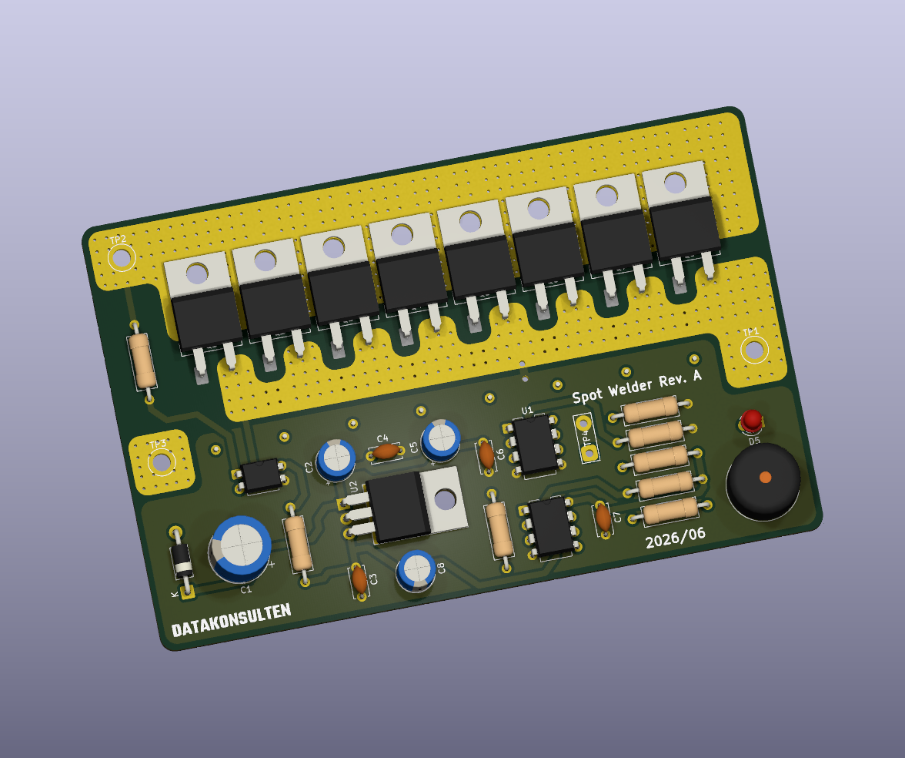
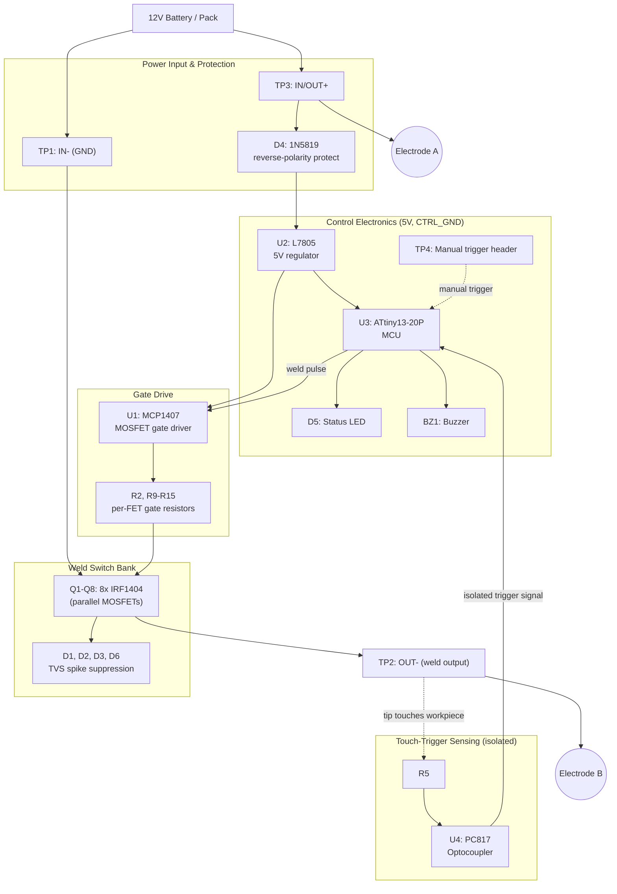
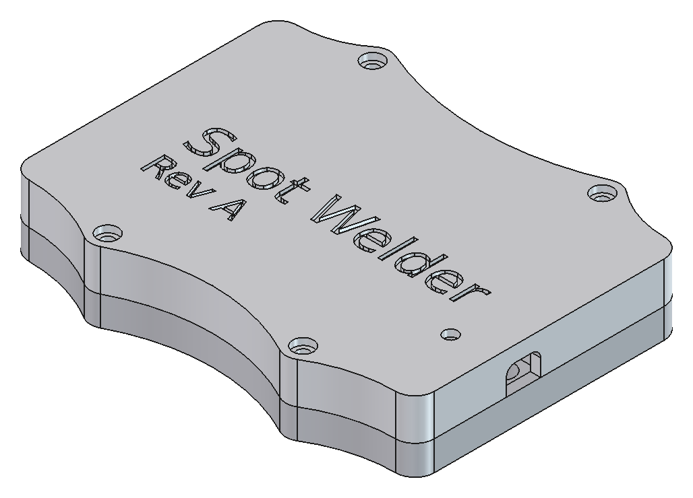
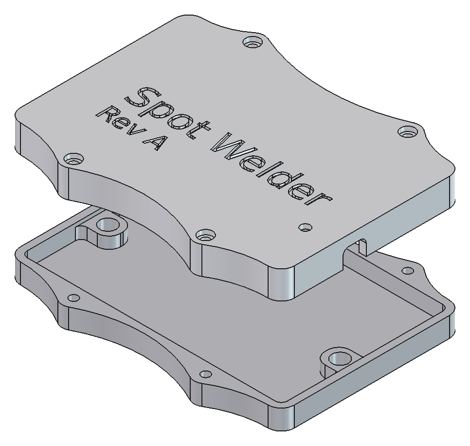

# Datakonsulten Spot Welder (Open Source Spot Welder)

Open-source, ATtiny13-controlled spot welder PCB for welding li-ion batteries (e.g. building battery packs), powered from a 12V car battery or other battery pack. Designed in KiCad, fabrication-ready Gerbers included.



> **⚠️ Status: untested.** This design has not yet been built up or bench-tested — the schematic, PCB, firmware, and enclosure are all believed-correct from design review, but no board has been verified working in hardware yet. Treat it as a work-in-progress until this notice is removed.

## Sponsor

PCB fabrication for this project is currently produced by [PCBWay](https://www.pcbway.com/).

## Features

- **High-current parallel MOSFET switching bank** — 8× IRF1404 N-channel MOSFETs (TO-220) in parallel, each with its own 10 Ω gate resistor for balanced, ring-free switching of the paralleled bank.
- **Dedicated MOSFET gate driver** — MCP1407 single-channel high-current driver delivers fast, strong gate drive to all 8 FETs simultaneously, with a pull-down (R16) on its input so the FETs default OFF if the MCU isn't actively driving it (fail-safe on reset/power-up).
- **Automatic touch-to-weld triggering** — a PC817 optocoupler senses when both welding tips touch the metal workpiece (current path between the FET drain and source rails) and signals the MCU to fire a weld pulse — no foot pedal required.
- **Manual trigger header** — a secondary 2-pin test point (TP4) wired to a spare MCU pin lets you wire up a manual pushbutton/foot switch instead.
- **ATtiny13-20P microcontroller** — handles trigger detection, weld pulse timing, status LED, and buzzer feedback in a single 8-pin DIP.
- **Isolated control/power grounds** — the high-current welding ground (`GND`) and the clean logic ground (`CTRL_GND`) are kept separate and joined at a single star point (net-tie) to keep switching noise off the MCU's reference.
- **Reverse-polarity protected supply** — a Schottky diode (1N5819) protects the onboard L7805 linear regulator (and all logic) if the battery is connected backwards.
- **Transient/spike suppression** — 4× 5.0SMDJ14A TVS (transil) diodes clamp inductive voltage spikes from the welding cables/electrodes when the FET bank switches off.
- **Audible + visual feedback** — onboard buzzer and status LED, both driven directly from the ATtiny13.
- **Direct high-current connections** — power in and weld output are large plated test points/pads (no connector contact resistance), rated for the heavy pulse currents a spot welder demands.
- **4-layer, 1.6 mm PCB with wide copper traces** — extra internal copper layers (In1.Cu, In2.Cu) used to spread and sink the high pulse currents through the FET bank and ground planes. PCB traces alone are not enough for the full weld current — thick copper wire or busbar is recommended for the battery and electrode connections.

## How it works

1. **Power input** — connect a 12V car battery or battery pack at the `IN/OUT+` and `IN-` test points. Positive is shared straight through to one weld electrode; negative feeds the MOSFET bank's source rail.
2. **Trigger detection** — when the two welding tips touch the metal workpiece, a small current flows through the workpiece resistance, pulling the `OUT-` rail relative to `GND` enough to forward-bias the PC817's LED. The opto's isolated phototransistor output tells the ATtiny13 "tips are touching, weld now."
3. **Weld pulse** — the ATtiny13 drives the MCP1407 gate driver input, which simultaneously switches all 8 paralleled IRF1404 MOSFETs on for a precisely-timed pulse (or pulses), dumping a short burst of high current through the workpiece to fuse the nickel strip to the cell.
4. **Feedback** — the buzzer and LED confirm the weld pulse fired.
5. **Protection** — reverse-polarity diode, TVS clamps, and the gate pull-down resistor protect the electronics from miswiring, switching transients, and spurious FET turn-on.

## Block diagram

High-level signal/power flow between the major blocks (component references in parentheses):



## Key components (BOM highlights)

| Ref | Part | Role |
|---|---|---|
| U1 | MCP1407 | High-current MOSFET gate driver |
| U2 | L7805 | 5 V linear regulator for control electronics |
| U3 | ATtiny13-20P | Microcontroller — trigger logic, pulse timing, feedback |
| U4 | PC817 | Optocoupler — isolated tip-touch trigger sensing |
| Q1–Q8 | IRF1404 | Paralleled welding-current MOSFET switch bank |
| D1, D2, D3, D6 | 5.0SMDJ14A | TVS diodes — inductive spike suppression |
| D4 | 1N5819 | Schottky reverse-polarity protection |
| D5 | LED | Status indicator |
| BZ1 | Buzzer | Audible weld-complete/feedback tone |
| TP1 / TP2 / TP3 | Test points | `IN-` / `OUT-` / `IN/OUT+` — power & weld electrode connections |
| TP4 | 2-pole test point | Optional manual trigger button header |
| NT1 | Net tie | Single-point bridge between power GND and control GND |

## PCB specifications

- **Layers:** 4 (F.Cu, In1.Cu, In2.Cu, B.Cu)
- **Thickness:** 1.6 mm
- **Outline:** ~112 × 72 mm
- **Design tool:** KiCad
- **Custom parts:** local symbol library (`SpotWelderLib`) and custom footprints (`SpotWelderFootprints.pretty`) for the MCP1407, TO-220-2 horizontal-tab MOSFETs, and SMC TVS diodes

## Firmware

`Firmware/main.c` is a from-scratch ATtiny13 firmware that drives every component on the board: the gate driver (weld pulses), both trigger inputs (auto tip-touch via the PC817 and the manual TP4 button), the status LED, and the buzzer. All tunable behavior lives in one `USER CONFIGURATION` block at the top of the file — edit the `#define`s and rebuild, no need to touch the logic below.

| Define | Default | What it does |
|---|---|---|
| `WELD_PULSE_MS` | 18 | Main weld pulse duration |
| `USE_DOUBLE_PULSE` | 1 | Fire a short pre-pulse before the main pulse |
| `PRE_PULSE_MS` | 3 | Pre-pulse duration (seats the tips before the main weld) |
| `PULSE_GAP_MS` | 80 | Gap between pre-pulse and main pulse |
| `WELD_COOLDOWN_MS` | 800 | Minimum time after a weld before another can fire |
| `TRIGGER_DEBOUNCE_MS` | 15 | Debounce time on both trigger inputs |
| `REQUIRE_TRIGGER_RELEASE` | 1 | Require the trigger to go inactive before re-arming (prevents continuous arcing if the tips are left resting on the workpiece) |
| `BEEP_ON_WELD_MS` / `BEEP_ON_POWERUP_MS` | 60 / 80 | Buzzer feedback lengths |
| `BUZZER_ACTIVE_TYPE` | 1 | 1 = simple on/off drive for a self-oscillating buzzer (matches BZ1's direct GPIO wiring), 0 = generate a tone for a passive piezo |

Pin mapping (see the comment block in `main.c` for the schematic derivation): PB0 → buzzer, PB1 → status LED, PB2 → manual trigger (TP4), PB3 → opto auto-trigger, PB4 → MCP1407/weld enable. The firmware forces PB4 low before anything else runs, on top of the hardware pull-down (R16) already on that net.

Builds clean with `avr-gcc` at `-Os`: 208 bytes flash (20% of the ATtiny13's 1KB) / 0 bytes RAM with default settings.

```
cd Firmware
make            # build spotwelder.hex
make flash      # build and flash over ISP (default programmer: usbasp)
make fuses      # program factory-default fuses (9.6MHz int. RC / 8 = 1.2MHz)
```

## Enclosure

A two-piece (top + bottom) snap/screw-together enclosure, designed in FreeCAD, sized to house the PCB and wired for external battery and electrode cables.

| Assembled | Top / bottom split |
|---|---|
|  |  |

- Lid is engraved with "Spot Welder Rev A"
- 4× mounting bosses (screw points) align the top and bottom halves
- Side cutout for routing the battery/electrode cables out of the case
- Source: `Enclosure/SpotWelder.FCStd` (FreeCAD), with `SpotWelder-Top Body w_ Text.step` and `SpotWelder-Bottom Body.step` as neutral STEP exports for 3D printing or import into other CAD tools

## Repository structure

```
KiCad/        KiCad project — schematic, PCB layout, custom symbols/footprints, 3D model, project backups
Gerbers/      Fabrication output (Gerbers + drill files) ready to send to a PCB manufacturer
Firmware/     ATtiny13 firmware (main.c + Makefile)
Enclosure/    FreeCAD enclosure design (top + bottom body, STEP exports, renders)
```

## Status

Hardware design (schematic + PCB + fab outputs), firmware, and enclosure are all complete on paper. **Functionality has not yet been tested** — no assembled board has been powered up or used to weld anything yet. PCBs are currently being produced by PCBWay; testing/validation will follow once boards are in hand.

## Safety

This board switches very high pulse currents from a battery directly through bare MOSFETs and exposed welding tips. Incorrect wiring, a shorted output, or firmware bugs in the pulse timing can cause overheating, fire, or battery damage. Use thick copper wire or busbar for the battery and electrode connections — PCB copper alone is not rated for the full weld current. Build and operate at your own risk, use appropriate fusing/current limiting on your battery source, and never leave the welder connected to a battery unattended. **Since this design is untested, inspect and verify every connection yourself before applying power, and expect to debug issues rather than assume a working result.**

## License

Licensed under **Creative Commons Attribution-NonCommercial-ShareAlike 4.0 International (CC BY-NC-SA 4.0)** — see [LICENCE.md](LICENCE.md). You're free to build, modify, and share this design for personal/non-commercial use with attribution and share-alike. Commercial manufacturing and resale of boards based on this design is reserved to Datakonsulten Sverige AB; contact us if you'd like to discuss a commercial license.
